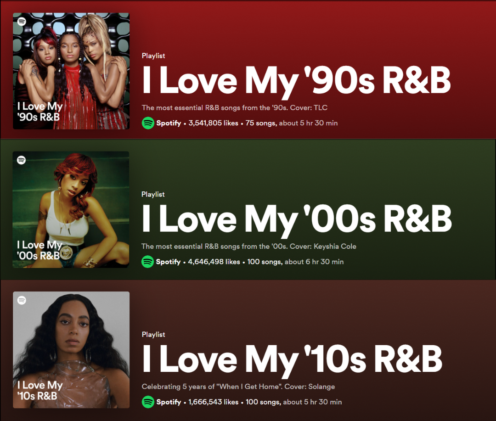

```{r, eval = FALSE}
remotes::install_github('jaburgoyne/compmus')
```

```{r, setup}
library(tidyverse)
library(spotifyr)
library(compmus)
```


Week 11 {.storyboard}
=========================================

### Novelty Functions - Hold Me Down (Daniel Caeser)

```{r}
holdmedown <-
  get_tidy_audio_analysis("1Mza2sr6tPhy6jjI3HB9fW") |>
  select(segments) |>
  unnest(segments)
``` 


```{r}
holdmedown |>
  mutate(loudness_max_time = start + loudness_max_time) |>
  arrange(loudness_max_time) |>
  mutate(delta_loudness = loudness_max - lag(loudness_max)) |>
  ggplot(aes(x = loudness_max_time, y = pmax(0, delta_loudness))) +
  geom_line() +
  xlim(0, 30) +
  theme_minimal() +
  labs(x = "Time (s)", y = "Novelty")
```

------------------------------------------------------------------------

This graph shows the energy-based novelty function for the song ["Hold Me Down" by Daniel Caesar](https://open.spotify.com/track/1Mza2sr6tPhy6jjI3HB9fW?si=f550b8fb5caa4978). Looking at the graph (Half wave rectification), I would say that it does not show a very clear novelty function as the peaks are not very regular. The novelty values fluctuate around 0-7. There are some recurring peaks at around the value 5 (can be seen from 15-20 seconds), however, it is quite inconsistent.


### Spectral Novelty Function - Hold Me Down 
```{r}
holdmedown2 <-
  get_tidy_audio_analysis("1Mza2sr6tPhy6jjI3HB9fW") |>
  select(segments) |>
  unnest(segments)
``` 

```{r}
holdmedown2 |>
  mutate(pitches = map(pitches, compmus_normalise, "clr")) |>
  arrange(start) |>
  mutate(pitches = map2(pitches, lag(pitches), `-`)) |>
  slice(-1) |> 
  compmus_gather_chroma() |> 
  group_by(start, duration) |> 
  summarise(novelty = sum(log1p(pmax(value, 0)))) |> 
  ggplot(aes(x = start + duration / 2, y = novelty)) +
  geom_line() +
  xlim(0, 30) +
  theme_minimal() +
  labs(x = "Time (s)", y = "Novelty")
```

------------------------------------------------------------------------

I wanted to see how the visualization and the result would change if using a spectral novelty function instead for the same song (Hold Me Down). This visualization shows even more variability, which confirms the point made in the previous tab where there is not a very clear novelty function detected as we are not getting regular peaks. Moreover, there are some similar patterns that can be pointed out like around seconds 15-18, and 24-30 where peaks reoccurs.  


### My Second Novelty Functions - Trip (Ella Mai)
```{r}
trip <-
  get_tidy_audio_analysis("6CTWathupIiDs7U4InHnDA") |>
  select(segments) |>
  unnest(segments)
``` 

```{r}
trip |>
  mutate(pitches = map(pitches, compmus_normalise, "clr")) |>
  arrange(start) |>
  mutate(pitches = map2(pitches, lag(pitches), `-`)) |>
  slice(-1) |> 
  compmus_gather_chroma() |> 
  group_by(start, duration) |> 
  summarise(novelty = sum(log1p(pmax(value, 0)))) |> 
  ggplot(aes(x = start + duration / 2, y = novelty)) +
  geom_line() +
  xlim(0, 30) +
  theme_minimal() +
  labs(x = "Time (s)", y = "Novelty")
#spectral based, here we are not getting regular peaks. This is not very clear. Thus not a clear novelty function. 
```

------------------------------------------------------------------------

This is another spectral novelty function on the song ["Trip" by Ella Mai](https://open.spotify.com/track/6CTWathupIiDs7U4InHnDA?si=eb9073fbe6a0466b), a very well known and representative song for 2010s R&B as it was released in 2018 and was [top 11 on the billboard hot 100 chart in the US](https://www.billboard.com/artist/ella-mai/). The peaks are slightly more regular compared to the song "Hold Me Down" in the previous tabs. Meaning that there is a clearer novelty function. 
 
<iframe style="border-radius:12px" src="https://open.spotify.com/embed/track/6CTWathupIiDs7U4InHnDA?utm_source=generator" width="100%" height="352" frameBorder="0" allowfullscreen="" allow="autoplay; clipboard-write; encrypted-media; fullscreen; picture-in-picture" loading="lazy"></iframe>

### Tempogram 1 
This is where the tempograms are suppose to be but I have taken them out for now because it takes forever to load/knit. 

### Tempogram 2
This is where the tempograms are suppose to be but I have taken them out for now because it takes forever to load/knit. 


###  Comparing Average Tempo of the 3 playlists
```{r}
playlist90 <- get_playlist_audio_features("", "37i9dQZF1DX6VDO8a6cQME")
playlist00 <- get_playlist_audio_features("", "37i9dQZF1DWYmmr74INQlb")
playlist10 <- get_playlist_audio_features("", "37i9dQZF1DWXbttAJcbphz")

mixes <-
  bind_rows(
    playlist90 |> mutate(category = "1990s"),
    playlist00 |> mutate(category = "2000s"),
    playlist10 |> mutate(category = "2010s")
      )
```

```{r}

avg_tempo_by_decade <- mixes %>%
  group_by(category) %>%
  summarise(AverageTempo = mean(tempo, na.rm = TRUE))

# Visualize the average tempo with a more carefully adjusted y-axis
ggplot(avg_tempo_by_decade, aes(x = category, y = AverageTempo, fill = category)) +
  geom_bar(stat = "identity", show.legend = FALSE) +
  theme_minimal() +
  scale_fill_brewer(palette = "Purples") +
  labs(title = "Average Tempo Comparison Among Decades",
       x = "Decade",
       y = "Average Tempo (BPM)") +
  geom_text(aes(label = round(AverageTempo, 1)), vjust = -0.5) +
  coord_cartesian(ylim = c(110, 115))
```

------------------------------------------------------------------------

This bar graph shows the comparison of the average tempo of all three playlists. It is clear that there is a slight increase in the average tempo throughout the years. There is a 0.7 difference between the 1990s and 2000s playlist. and a 0.9 difference between 2000s and 2010s playlist. A 1.6 difference between the two playlist furthest apart (90s and 2010s). 

This may be due to multiple reasons: 
1. R&B mixing with other genres, such as EDM, Pop or Hip-hop (which often features higher tempos)
2. Listener preferences change over the decades and many may favor more upbeat tracks that are danceable (fitting for events, parties, workouts and other scenarios)
3. Similar to the previous point, faster and upbeat songs are more likely to capture audience/listeners' attention. 
These are some reasons that might explain the increase of song tempos/BPMs through the years. 


Introduction {.storyboard}
=========================================

### Welcome

```{r picture, echo = F, fig.cap = "Corpus Playlists", out.width = '50%'}

```

------------------------------------------------------------------------

Welcome to Maggie's Computational Musicology Dashboard.

Firstly, I would like to introduce the corpus that I have chosen. My corpus consists of three playlists that are under the Rhythm and Blues (R&B) genre. I decided to pick R&B because it was one of my top most listened-to genres according to the end-of-the-year Spotify Wrapped. Additionally, I would like to learn more about the characteristics of the genre and its long, rich history. R&B is an interesting genre as it is common to see mixes with other popular genres like hip-hop, soul, jazz, and more. The playlists in my corpus differ in decades, the first playlist consists of the top 100 “most essential” R&B songs of the 1990s. The second and third playlists are for the decade 2000s and 2010s respectively. The 1990s playlist consists of 75 songs, the 2000s playlist consists of 100 songs and the 2010s playlist consists of 100 songs. The playlists were directly found on and created by Spotify.


Week 10 {.storyboard}
=========================================
    
### Chordograms

```{r, results = 'hide'}
library(tidyverse)
library(spotifyr)
library(compmus)
```

```{r, echo=FALSE}
circshift <- function(v, n) {
  if (n == 0) v else c(tail(v, n), head(v, -n))
}

#      C     C#    D     Eb    E     F     F#    G     Ab    A     Bb    B
major_chord <-
  c(   1,    0,    0,    0,    1,    0,    0,    1,    0,    0,    0,    0)
minor_chord <-
  c(   1,    0,    0,    1,    0,    0,    0,    1,    0,    0,    0,    0)
seventh_chord <-
  c(   1,    0,    0,    0,    1,    0,    0,    1,    0,    0,    1,    0)

chord_templates <-
  tribble(
    ~name, ~template,
    "Gb:7", circshift(seventh_chord, 6),
    "Gb:maj", circshift(major_chord, 6),
    "Bb:min", circshift(minor_chord, 10),
    "Db:maj", circshift(major_chord, 1),
    "F:min", circshift(minor_chord, 5),
    "Ab:7", circshift(seventh_chord, 8),
    "Ab:maj", circshift(major_chord, 8),
    "C:min", circshift(minor_chord, 0),
    "Eb:7", circshift(seventh_chord, 3),
    "Eb:maj", circshift(major_chord, 3),
    "G:min", circshift(minor_chord, 7),
    "Bb:7", circshift(seventh_chord, 10),
    "Bb:maj", circshift(major_chord, 10),
    "D:min", circshift(minor_chord, 2),
    "F:7", circshift(seventh_chord, 5),
    "F:maj", circshift(major_chord, 5),
    "A:min", circshift(minor_chord, 9),
    "C:7", circshift(seventh_chord, 0),
    "C:maj", circshift(major_chord, 0),
    "E:min", circshift(minor_chord, 4),
    "G:7", circshift(seventh_chord, 7),
    "G:maj", circshift(major_chord, 7),
    "B:min", circshift(minor_chord, 11),
    "D:7", circshift(seventh_chord, 2),
    "D:maj", circshift(major_chord, 2),
    "F#:min", circshift(minor_chord, 6),
    "A:7", circshift(seventh_chord, 9),
    "A:maj", circshift(major_chord, 9),
    "C#:min", circshift(minor_chord, 1),
    "E:7", circshift(seventh_chord, 4),
    "E:maj", circshift(major_chord, 4),
    "G#:min", circshift(minor_chord, 8),
    "B:7", circshift(seventh_chord, 11),
    "B:maj", circshift(major_chord, 11),
    "D#:min", circshift(minor_chord, 3)
  )
```


```{r, echo = FALSE}
get_tidy_audio_analysis("1z6WtY7X4HQJvzxC4UgkSf") |> # Love On Top
  compmus_align(bars, segments) |>
  select(bars) |> # you can also change to sections
  unnest(bars) |>
  mutate(
    pitches =
      map(segments,
        compmus_summarise, pitches,
        method = "mean", norm = "manhattan"
      )
  ) |> 
  compmus_match_pitch_template(chord_templates, "euclidean", "manhattan") |> # chord or key gram 
  ggplot(
    aes(x = start + duration / 2, width = duration, y = name, fill = d)
  ) +
  geom_tile() +
  scale_fill_viridis_c(guide = "none") +
  theme_minimal() +
  labs(x = "Time (s)", y = "")
```

------------------------------------------------------------------------

Another classic R&B song (in the 2010s playlist), "Love on Top" by Beyonce. You can see from around 180 seconds, there is a shift in the chords being used as all the way to the end of the song there is a series of modulations. There is a total of 4 modulations that go upward chromatically. 

### Keygrams

```{r}
circshift <- function(v, n) {
  if (n == 0) v else c(tail(v, n), head(v, -n))
}

#      C     C#    D     Eb    E     F     F#    G     Ab    A     Bb    B
major_chord <-
  c(   1,    0,    0,    0,    1,    0,    0,    1,    0,    0,    0,    0)
minor_chord <-
  c(   1,    0,    0,    1,    0,    0,    0,    1,    0,    0,    0,    0)
seventh_chord <-
  c(   1,    0,    0,    0,    1,    0,    0,    1,    0,    0,    1,    0)

major_key <-
  c(6.35, 2.23, 3.48, 2.33, 4.38, 4.09, 2.52, 5.19, 2.39, 3.66, 2.29, 2.88)
minor_key <-
  c(6.33, 2.68, 3.52, 5.38, 2.60, 3.53, 2.54, 4.75, 3.98, 2.69, 3.34, 3.17)

chord_templates <-
  tribble(
    ~name, ~template,
    "Gb:7", circshift(seventh_chord, 6),
    "Gb:maj", circshift(major_chord, 6),
    "Bb:min", circshift(minor_chord, 10),
    "Db:maj", circshift(major_chord, 1),
    "F:min", circshift(minor_chord, 5),
    "Ab:7", circshift(seventh_chord, 8),
    "Ab:maj", circshift(major_chord, 8),
    "C:min", circshift(minor_chord, 0),
    "Eb:7", circshift(seventh_chord, 3),
    "Eb:maj", circshift(major_chord, 3),
    "G:min", circshift(minor_chord, 7),
    "Bb:7", circshift(seventh_chord, 10),
    "Bb:maj", circshift(major_chord, 10),
    "D:min", circshift(minor_chord, 2),
    "F:7", circshift(seventh_chord, 5),
    "F:maj", circshift(major_chord, 5),
    "A:min", circshift(minor_chord, 9),
    "C:7", circshift(seventh_chord, 0),
    "C:maj", circshift(major_chord, 0),
    "E:min", circshift(minor_chord, 4),
    "G:7", circshift(seventh_chord, 7),
    "G:maj", circshift(major_chord, 7),
    "B:min", circshift(minor_chord, 11),
    "D:7", circshift(seventh_chord, 2),
    "D:maj", circshift(major_chord, 2),
    "F#:min", circshift(minor_chord, 6),
    "A:7", circshift(seventh_chord, 9),
    "A:maj", circshift(major_chord, 9),
    "C#:min", circshift(minor_chord, 1),
    "E:7", circshift(seventh_chord, 4),
    "E:maj", circshift(major_chord, 4),
    "G#:min", circshift(minor_chord, 8),
    "B:7", circshift(seventh_chord, 11),
    "B:maj", circshift(major_chord, 11),
    "D#:min", circshift(minor_chord, 3)
  )

key_templates <-
  tribble(
    ~name, ~template,
    "Gb:maj", circshift(major_key, 6),
    "Bb:min", circshift(minor_key, 10),
    "Db:maj", circshift(major_key, 1),
    "F:min", circshift(minor_key, 5),
    "Ab:maj", circshift(major_key, 8),
    "C:min", circshift(minor_key, 0),
    "Eb:maj", circshift(major_key, 3),
    "G:min", circshift(minor_key, 7),
    "Bb:maj", circshift(major_key, 10),
    "D:min", circshift(minor_key, 2),
    "F:maj", circshift(major_key, 5),
    "A:min", circshift(minor_key, 9),
    "C:maj", circshift(major_key, 0),
    "E:min", circshift(minor_key, 4),
    "G:maj", circshift(major_key, 7),
    "B:min", circshift(minor_key, 11),
    "D:maj", circshift(major_key, 2),
    "F#:min", circshift(minor_key, 6),
    "A:maj", circshift(major_key, 9),
    "C#:min", circshift(minor_key, 1),
    "E:maj", circshift(major_key, 4),
    "G#:min", circshift(minor_key, 8),
    "B:maj", circshift(major_key, 11),
    "D#:min", circshift(minor_key, 3)
  )
```

```{r}
rememberthetime <-
  get_tidy_audio_analysis("4jnFqNWeJCeCRHc4HCdxfd") |> #Remember the Time
  compmus_align(sections, segments) |>
  select(sections) |>
  unnest(sections) |>
  mutate(
    pitches =
      map(segments,
        compmus_summarise, pitches,
        method = "mean", norm = "manhattan"
      )
  )
```

```{r}
rememberthetime |> 
  compmus_match_pitch_template(
    key_templates,         # Change to chord_templates if descired
    method = "euclidean",  # Try different distance metrics
    norm = "manhattan"     # Try different norms
  ) |>
  ggplot(
    aes(x = start + duration / 2, width = duration, y = name, fill = d)
  ) +
  geom_tile() +
  scale_fill_viridis_c(guide = "none") +
  theme_minimal() +
  labs(x = "Time (s)", y = "")
```

------------------------------------------------------------------------

This is a keygram of the song "Remember the Time" by Michael Jackson. Another very well known R&B song part of the 1990s playlist. I am not sure exactly how to dissect this. There is a yellow strip in the middle around the 130 seconds mark and that is around when the bridge begins.


### Timbre Coefficients

```{r}
play90s <-
  get_playlist_audio_features(
    "",
    "37i9dQZF1DX6VDO8a6cQME"
  ) |>
  slice(1:30) |>
  add_audio_analysis()
play10s <-
  get_playlist_audio_features(
    "",
    "37i9dQZF1DWXbttAJcbphz"
  ) |>
  slice(1:30) |>
  add_audio_analysis()
hello <-
  play90s |>
  mutate(genre = "R&B 1990s") |>
  bind_rows(play10s |> mutate(genre = "R&B 2010s"))
```

```{r}
hello |>
  mutate(
    timbre =
      map(
        segments, #seconds (?)
        compmus_summarise,
        timbre,
        method = "mean"
      )
  ) |>
  select(genre, timbre) |>
  compmus_gather_timbre() |>
  ggplot(aes(x = basis, y = value, fill = genre)) +
  geom_violin() +
  scale_fill_viridis_d() +
  labs(x = "Spotify Timbre Coefficients", y = "", fill = "Genre")
#What is the average value of these timbre feature 
#You can also do it with pitches instead of timbre here 
```

------------------------------------------------------------------------

I wanted to see the difference between my R&B playlists differing in era. Therefore, I chose the two playlists furthest away from each other (in terms of time). The dark purple color represents the R&B playlist of the 1990s and the yellow represents the 2010s. We can see that there is a noticeable difference in values for c02 (2010s is shorter) and c05 (2010s is longer and higher value). The remaining coefficients are relatively similar in shape. 


Week 9 {.storyboard}
=========================================

### Cepstrogram

```{r}
uptownfunk <-
  get_tidy_audio_analysis("32OlwWuMpZ6b0aN2RZOeMS") |> # Change URI.
  compmus_align(bars, segments) |>                     # Change `bars`
  select(bars) |>                                      #   in all three
  unnest(bars) |>                                      #   of these lines.
  mutate(
    pitches =
      map(segments,
        compmus_summarise, pitches,
        method = "rms", norm = "euclidean"              # Change summary & norm.
      )
  ) |>
  mutate(
    timbre =
      map(segments,
        compmus_summarise, timbre,
        method = "rms", norm = "euclidean"              # Change summary & norm.
      )
  )

uptownfunk |>
  compmus_gather_timbre() |>
  ggplot(
    aes(
      x = start + duration / 2,
      width = duration,
      y = basis,
      fill = value
    )
  ) +
  geom_tile() +
  labs(x = "Time (s)", y = NULL, fill = "Magnitude") +
  scale_fill_viridis_c() +                              
  theme_classic()
```

------------------------------------------------------------------------

Using the song "Uptown Funk" again, I created a cepstrogram just to see what kinds of patterns or information it may show. In the first 20 seconds, there is a slightly higher magnitude for c04. Highly likely that it is due to the high-pitched guitar in the background of the introduction. From around 50 seconds, there is only the siren, drums, and vocals used for building up to the beat drop, which is why you can see minimal magnitude. The beat drops (rich instrumental begins) around 67 seconds, which is also represented in c02 as it brightens up in yellow. I also see a correlation between the trumpets used in the song and the highest magnitude/brightest yellow in the cepstogram. This makes sense as c02 usually represents brightness. Around 170 seconds, you can see a drop in c01 and c02, this is the start of the bridge where there is nothing but vocals and drums, and then eventually the bass and other instruments join for the last chorus.


### Self-Similarity Matrices

```{r, echo = FALSE, message = FALSE, fig.width=8, fig.height=6}
library(tidyverse)
library(spotifyr)
library(compmus)
uptownfunk <-
  get_tidy_audio_analysis("32OlwWuMpZ6b0aN2RZOeMS") |>
  compmus_align(bars, segments) |>
  select(bars) |>
  unnest(bars) |>
  mutate(
    pitches =
      map(segments,
        compmus_summarise, pitches,
        method = "acentre", norm = "manhattan"
      )
  ) |>
  mutate(
    timbre =
      map(segments,
        compmus_summarise, timbre,
        method = "mean"
      )
  )
bind_rows(
  uptownfunk |>
    compmus_self_similarity(pitches, "aitchison") |>
    mutate(d = d / max(d), type = "Chroma"),
  uptownfunk |>
    compmus_self_similarity(timbre, "euclidean") |>
    mutate(d = d / max(d), type = "Timbre")
) |>
  mutate() |>
  ggplot(
    aes(
      x = xstart + xduration / 2,
      width = xduration,
      y = ystart + yduration / 2,
      height = yduration,
      fill = d
    )
  ) +
  geom_tile() +
  coord_fixed() +
  facet_wrap(~type) +
  scale_fill_viridis_c(guide = "none") +
  theme_classic() +
  labs(x = "", y = "")
```

------------------------------------------------------------------------

The two self-similarity matrices of "Uptown Funk" by Mark Ronson and Bruno Mars (chroma and timbre). I chose this song as it is a blend of multiple other genres other than R&B, such as funk, soul, jazz, and pop. Looking at chroma, there are around 7-8 sections. It is interesting to see the yellow sections (strips), this is an indication of the pre-chorus, which has a lower pitch than the chorus as it is mainly comprised of only vocals and drums. The change in instrumentation during the bridge (around min 2:50 or 170 seconds) can be seen in the timbre, making a big yellow cross.

```{r, echo=FALSE}
library(htmltools)

tags$iframe(src="https://open.spotify.com/embed/track/32OlwWuMpZ6b0aN2RZOeMS", width="300", height="80", frameborder="0", allowtransparency="true", allow="encrypted-media")
```

Week 8 {.storyboard}
=========================================

### Chromagram #1 - The Boy Is Mine (Brandy and Monica)
```{r}
theboyismine <-
  get_tidy_audio_analysis("6sHsXIJoEN5JpdkGMQDJxt") |>
  select(segments) |>
  unnest(segments) |>
  select(start, duration, pitches)
```

```{r}
theboyismine |>
  mutate(pitches = map(pitches, compmus_normalise, "euclidean")) |>
  compmus_gather_chroma() |> 
  ggplot(
    aes(
      x = start + duration / 2,
      width = duration,
      y = pitch_class,
      fill = value
    )
  ) +
  geom_tile() +
  labs(title = "The Boy Is Mine - Brandy and Monica", subtitle = "'I Love my '90s R&B' Playlist", x = "Time (s)", y = NULL, fill = "Magnitude") +
  theme_minimal() +
  scale_fill_viridis_c()
```

------------------------------------------------------------------------

This chromagram is made for a specific song in the 1990s playlist called "The Boy Is Mine" by Brandy and Monica. It is a very typical, well-known, and popular song in the R&B genre. In the chromagram, it is clear that the prominent and "loudest" note is C# shown by the magnitude (also how yellow the row is). Following that, G# and F# are also very prominent. Also worth mentioning that A, B, E, and D# are also relatively high in magnitude. It all makes sense because all of these notes belong in the C# minor scale, which is also the key to this song.

I think it is super interesting to see that the first 24/25 seconds are quite empty compared to the rest of the song because only the main melody can be heard clearly and there are almost no other instruments other than some chimes. After the 25th second, the drums, background instruments, vocals, etc come in.

```{r, echo=FALSE}
library(htmltools)

tags$iframe(src="https://open.spotify.com/embed/track/6sHsXIJoEN5JpdkGMQDJxt", width="300", height="80", frameborder="0", allowtransparency="true", allow="encrypted-media")
```

### Chromagram #2 - Love on Top (Beyonce)
```{r}
loveontop <-
  get_tidy_audio_analysis("1z6WtY7X4HQJvzxC4UgkSf") |> #Love On Top
  select(segments) |>
  unnest(segments) |>
  select(start, duration, pitches)
```

```{r}
loveontop |>
  mutate(pitches = map(pitches, compmus_normalise, "euclidean")) |>
  compmus_gather_chroma() |> 
  ggplot(
    aes(
      x = start + duration / 2,
      width = duration,
      y = pitch_class,
      fill = value
    )
  ) +
  geom_tile() +
  labs(title = "Love On Top - Beyonce", subtitle = "'I Love my '10s R&B' Playlist", x = "Time (s)", y = NULL, fill = "Magnitude") +
  theme_minimal() +
  scale_fill_viridis_c()
```

------------------------------------------------------------------------

Still need to edit this.

```{r, echo=FALSE}
library(htmltools)

tags$iframe(src="https://open.spotify.com/embed/track/1z6WtY7X4HQJvzxC4UgkSf", width="300", height="80", frameborder="0", allowtransparency="true", allow="encrypted-media")
```


Week 7 {.storyboard}
=========================================

### Duration of songs through the eras

```{r}
playlist90 <- get_playlist_audio_features("", "37i9dQZF1DX6VDO8a6cQME")
playlist00 <- get_playlist_audio_features("", "37i9dQZF1DWYmmr74INQlb")
playlist10 <- get_playlist_audio_features("", "37i9dQZF1DWXbttAJcbphz")

mixes <-
  bind_rows(
    playlist90 |> mutate(category = "1990s"),
    playlist00 |> mutate(category = "2000s"),
    playlist10 |> mutate(category = "2010s")
      )
```

```{r, echo=FALSE, message=FALSE, fig.width=12, fig.height=6}
library(ggplot2)
library(dplyr)
library(patchwork)

mixes_sorted <- mixes %>%
  arrange(category, track.duration_ms) %>%
  group_by(category) %>%
  mutate(song_index = row_number()) %>%
  mutate(duration_seconds = track.duration_ms / 1000)

p1 <- ggplot(mixes_sorted, aes(x = song_index, y = duration_seconds, color = category)) +
  geom_line() +
  labs(x = "Song Index", y = "Duration (seconds)", title = "Song Durations in R&B Playlists by Era") +
  theme_minimal()

mixes_sorted1 <- mixes %>%
  arrange(category, track.album.release_date) %>%
  mutate(duration_seconds = track.duration_ms/1000, 
         song_index = row_number())

p2 <- ggplot(mixes_sorted1, aes(x = song_index, y = duration_seconds, color = category)) +
  geom_line() +
  geom_smooth(method = "lm", se = FALSE, color = "black", linewidth = 0.2) +  # Add a linear model trend line
  labs(x = "Song Index", y = "Duration (seconds)", title = "Song Durations in R&B Playlists by Release Date") +
  theme_minimal()

p1 + p2
```

------------------------------------------------------------------------

Here, I am looking at the change in duration of songs throughout each decade. Due to many reasons, one of them being the introduction of music streaming, songs are becoming shorter in terms of duration. Therefore, I decided to plot/visualize it based on the duration of the songs. Having recently become acquainted with R, I tried making the plots look presentable and clear. I felt that a line graph would be the most appropriate to use to visualize duration and change across time. Additionally, I decided to convert the duration from ms to seconds for clearer representation and assessment.

Looking at the first line plot and comparing the shortest duration for each decade, it is not surprising to see that the 2010s playlists include songs with the shortest duration of less than 100 seconds, which is less than one minute and a half. Moreover, the 1990s playlist included the song with the longest duration out of the entire corpus, being over 400 seconds long (almost 500 seconds, around 8 minutes).

In the second line plot, a connected line graph was used to visually depict the progression of song durations across different time periods. The trend line shows a clear downward trajectory and gradual decline as time goes by, which implies that the duration of songs is getting shorter over the years

### More Experiments
```{r}
compare90vs10 <-
  bind_rows(
    playlist90 |> mutate(category = "1990s"),
    playlist10 |> mutate(category = "2010s")
  )
```

```{r}
library(tibble)
label_data <- tibble(
  label = c("Remember the Time", "Session 32"),
  category = c("1990s", "2010s"),
  valence = c(0.795, 0.1170),
  energy = c(0.921, 0.123),
  nudge_x = c(-0.2, 0.02) 
)

compare90vs10 |>                    # Start with awards.
  mutate(
    mode = ifelse(mode == 0, "Minor", "Major")
  ) |>
  ggplot(                     # Set up the plot.
    aes(
      x = valence,
      y = energy,
      size = loudness,
      colour = mode
    )
  ) +
  geom_point() +              # Scatter plot.
  geom_rug(linewidth = 0.1) + # Add 'fringes' to show data distribution.
  geom_text(data = tibble(label = "Remember the Time",
                          category = "1990s",
                          valence = 0.795,
                          energy = 0.921),
            aes(x = valence, y = energy, label = label),
            nudge_x = -0.58, 
            colour = "black", size = 3, hjust = "left", vjust = "center")+
  geom_text(data = tibble(label = "Session 32",
                          category = "2010s",
                          valence = 0.1170,
                          energy = 0.123),
            aes(x = valence, y = energy, label = label),
            nudge_x = 0.025, # Slightly nudge "Session 32" to the right
            colour = "black", size = 3, hjust = "left", vjust = "center")+
  facet_wrap(~ category) +    # Separate charts per playlist.
  scale_x_continuous(         # Fine-tune the x axis.
    limits = c(0, 1),
    breaks = c(0, 0.50, 1),   # Use grid-lines for quadrants only.
    minor_breaks = NULL       # Remove 'minor' grid-lines.
  ) +
  scale_y_continuous(         # Fine-tune the y axis in the same way.
    limits = c(0, 1),
    breaks = c(0, 0.50, 1),
    minor_breaks = NULL
  ) +
  scale_colour_brewer(        # Use the Color Brewer to choose a palette.
    type = "qual",            # Qualitative set.
    palette = "Paired"        # Name of the palette is 'Paired'.
  ) +
  scale_size_continuous(      # Fine-tune the sizes of each point.
    trans = "exp",            # Use an exp transformation to emphasise loud.
    guide = "none"            # Remove the legend for size.
  ) +
  theme_light() +             # Use a simpler theme.
  labs(                       # Make the titles nice.
    x = "Valence",
    y = "Energy",
    colour = "Mode"
  )
```


